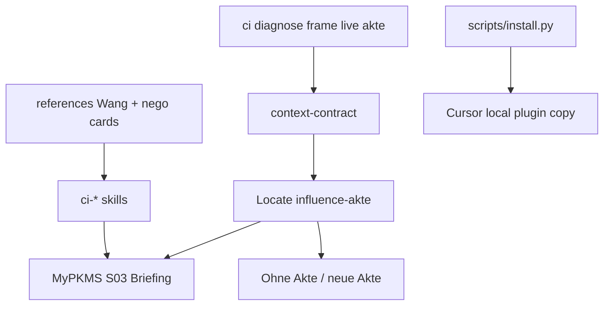

# Compound Influence Cursor Plugin - Plan

## Goal Capsule

- **Objective:** Ein eigenständiges Cursor-Plugin (`compound-influence`, c4-Form) liefern, das QuintSmart-Mandantenarbeit zu Angebot, Pricing und internem Buy-in über vier Commands und eine weiche PKMS-S03-Briefing-Akte compoundet.
- **Product authority:** Session-settled Product Contract. Dieses Artifact owns Plugin-Verhalten und Akte-Vertrag. Loop-Orchestrator als Haupt-Einstieg, Pricing-Rechner und Arena-Defaults für AI:mpulskraft/Karriere sind nicht aktiver Scope.
- **Open blockers:** Keine.
- **Execution profile:** Smoke-first for hull install. Fixture-first for Akte-Contract, Locate/Write-back, and skill door checks.
- **Stop conditions:** Do not store live Mandanten-Akten in this checkout. Do not symlink the local plugin. Do not require live PKMS Literature Notes for the core run. Do not ship a Loop-Orchestrator as the default entry.
- **Tail ownership:** Implementer ships hull, contracts, framework cards, four skills, fixtures, and copy-install. Operator runs install, enables the local plugin, reloads Cursor, and confirms one S03 Akte round-trip.
- **Product Contract preservation:** Product Contract unchanged. Outstanding Questions resolved into KTD1–KTD7.

**Target repo:** compound-influence

---

## Product Contract

### Summary

`compound-influence` ist ein lokales Cursor-Plugin mit vier gleichberechtigten Slash-Commands: Pre-Pitch-Diagnose, Message-Framing, Live-Verhandlung und Briefing-Akte.
Eine weiche Briefing-Akte in PKMS S03 (Mandantenprojekt) ist das Langzeitgedächtnis; brauchbare Outputs werden standardmäßig zurückgeschrieben.
Methodenkarten (Claire Wang / Price of Influence, Voss/Negotiation, ggf. GASP/SCR) liegen gebündelt im Plugin-Repo, nicht live aus dem Vault.

### Problem Frame

Angebot, Pricing und internes Buy-in bei Mandanten scheitern oft nicht an fehlender Logik, sondern an falschem Buyer-Value, fehlendem Felt Problem oder Framing in der eigenen statt der Buyer-Sprache.
Claire Wang und vorhandene PKMS-Negotiation-Bausteine (u. a. Voss) liefern Frameworks, aber kein wiederkehrendes Cursor-Betriebssystem.
Ohne Akte versanden Diagnosen und Live-Antworten zwischen Sessions; ohne Commands bleibt Wissen in Literature Notes stecken.

### Key Decisions

- **Alle vier Surfaces in einem Plugin** — Diagnose, Framing, Live, Akte. (session-settled: user-directed — chosen over single-surface V1: ein Schnitt ohne die anderen Surfaces zerbricht den Loop.) Governs R1, R2, R3, R4.
- **Hybrid-Einstieg** — vier gleichberechtigte Commands; Akte weich gekoppelt, nicht Pflicht-Gate. (session-settled: user-approved — chosen over Akte-Pflicht / reines 4 ohne Prompt: Flexibilität plus Kohärenz.) Governs R5, R6.
- **Ansatz A: Command Pack + Akte-Contract** — c4/cw-förmig, kein Loop-Orchestrator als Default. (session-settled: user-directed — chosen over B Loop-first / C Negotiation-first / A+Loop von Tag 1.) Governs R1, R2, R3, R4, R5, R6, R7.
- **Eigenes Repo `compound-influence`** — Produkt-Heimat wie `compound-4mat`. (session-settled: user-directed — chosen over KI-OS-Plugin-Hülle.) Governs R14.
- **Arena QuintSmart/Mandanten** — Defaults und Beispiele für Stakeholder-Buy-in und Angebot/Pricing. (session-settled: user-directed — chosen over neutral / AI:mpulskraft / Karriere.) Governs R10.
- **Akte in PKMS S03** — Mandantenprojekt im Vault. (session-settled: user-directed — chosen over Workspace / Plugin-lokal / immer fragen.) Governs R8, R9.
- **Frameworks gebündelt im Repo** — standalone Skills/Karten; PKMS hält Akten, nicht Methodik. (session-settled: user-directed — chosen over live-PKMS / Hybrid-Lookup.) Governs R11.
- **Erfolg = wiederkehrender Loop** — dieselbe Akte über Sessions, Default-Status aufbauen. (session-settled: user-directed — chosen over One-Shot-Text / nur Live-Replik.) Governs R12, R13.
- **Write-back Default** — brauchbare Diagnose-, Framing- und Live-Outputs landen in der Akte; Ablehnen möglich. (session-settled: user-directed — chosen over nur Nachfrage / Live ephemer.) Governs R9, R13.

<!-- ce-section: work-relationships -->
### How This Work Fits Together

Dieses Artifact owns das **Cursor-Plugin `compound-influence`** und den **Akte-Vertrag** (Verhalten, Surfaces, Write-back).
Die breitere Influence-/Pricing-Landschaft ist aktuelles Verständnis, kein Roadmap-Commit.

- **Optionaler Loop-Command** (Diagnose→Framing in einem Durchlauf)
  - Depends on: die vier Commands und der Akte-Vertrag
  - Still to decide: ob und wann als fünfter Command
- **KI-OS Routing-Zeiger** (wann Plugin vs. Paritäts-Skill)
  - Can proceed independently of: Plugin-MVP
- **Weitere Arena-Kalibrierungen** (AI:mpulskraft, Karriere)
  - Depends on: stabile Akte + Commands
  - Still to decide: ob eigene Defaults oder nur Akte-Felder

### Actors

- A1. **Operator** — QuintSmart; öffnet Commands vor Angebot, Pricing oder Buy-in.
- A2. **Cursor-Agent** — führt Skills aus, liest Framework-Karten, schreibt Akte nach Freigabe-Logik (Default Write-back mit Ablehnen).
- A3. **PKMS (S03)** — speichert Briefing-Akten pro Mandantenprojekt.
- A4. **Plugin-Checkout `compound-influence`** — kanonische Skills, Commands, Framework-Karten.

### Key Flows

- F1. **Akte anlegen oder öffnen**
  - **Trigger:** A1 startet den Akte-Command oder ein anderer Command fragt nach bestehender Akte.
  - **Actors:** A1, A2, A3
  - **Steps:** Mandanten-/Projektkontext klären; bestehende S03-Akte wählen oder neue anlegen; Schema-Felder (Buyer, Felt Problem, Wants/Fears/Constraints, nächster Ask, Verlauf) sichtbar machen.
  - **Covered by:** R4, R5, R7, R8
- F2. **Pre-Pitch-Diagnose**
  - **Trigger:** A1 prüft vor Pitch, ob Buyer und Felt Problem stimmen.
  - **Actors:** A1, A2, A3, A4
  - **Steps:** Optional Akte laden; Diagnosefragen (Buyer, Urgency, Upside vs. Risk, Pain/Cost/Gain); Ergebnis in Chat; Default Write-back in Akte (Ablehnen möglich).
  - **Covered by:** R1, R6, R7, R9, R10, R11, R13
- F3. **Message-Framing**
  - **Trigger:** A1 hat Entwurf (Mail, Angebot, Talking Points) und braucht Buyer-Sprache.
  - **Actors:** A1, A2, A3, A4
  - **Steps:** Optional Akte laden; Headline–Insights–CTA / Speak-their-language anwenden; umgeschriebene Version liefern; Default Write-back.
  - **Covered by:** R2, R6, R7, R9, R11, R13
- F4. **Live-Verhandlung**
  - **Trigger:** A1 braucht in einem heiklen Moment eine Replik (Pricing-Pushback, Buy-in-Widerstand).
  - **Actors:** A1, A2, A3, A4
  - **Steps:** Situation + Gegenstimme; Wang/Voss-Karten; Antwortoptionen; Default Write-back in Akte.
  - **Covered by:** R3, R6, R7, R9, R11, R13
- F5. **Wiederkehrender Loop**
  - **Trigger:** A1 öffnet dieselbe Mandanten-Akte in einer späteren Session.
  - **Actors:** A1, A2, A3
  - **Steps:** Akte laden; Verlauf und offenen Ask sehen; einen der Commands aus F2–F4 nutzen; Write-back compoundet Default-Status.
  - **Covered by:** R7, R8, R12, R13

### Requirements

**Surfaces**

- R1. Ein Slash-Command führt Pre-Pitch-Diagnose (Buyer, Felt Problem / Pain-Cost-Gain, strukturelle Ablehnung vs. Sweetening).
- R2. Ein Slash-Command führt Message-Framing (Buyer-Sprache, Headline–Insights–CTA, Destination-before-route).
- R3. Ein Slash-Command führt Live-Verhandlungshilfe (Antwortoptionen aus gebündelten Wang- und Negotiation-Karten).
- R4. Ein Slash-Command legt Briefing-Akten an oder öffnet sie und zeigt den Akte-Stand.

**Akte und Einstieg**

- R5. Jeder Command kann ohne Akte laufen; wenn eine passende S03-Akte existiert oder sinnvoll ist, bietet der Agent Nutzung / Neuanlage / Weiter ohne Akte an.
- R6. Die vier Commands sind gleichberechtigte Einstiege; keiner erzwingt die Reihenfolge der anderen.
- R7. Alle Commands teilen denselben Akte-Vertrag (Felder, Write-back-Verhalten, S03-Heimat), damit Outputs zwischen Surfaces kompatibel bleiben.
- R8. Neue Akten landen standardmäßig unter PKMS `S03 QuintSmart/…` im jeweiligen Mandanten-/Projektkontext (Pfadkonvention in Planning).
- R9. Brauchbare Outputs aus Diagnose, Framing und Live werden standardmäßig in die gewählte Akte geschrieben; A1 kann Write-back ablehnen oder überspringen.

**Inhalt und Kalibrierung**

- R10. Beispiele, Prompts und Default-Fragen sind auf QuintSmart-Mandanten (Angebot, Pricing, internes Buy-in) kalibriert.
- R11. Kern-Frameworks liegen als Karten/Skills im Plugin-Repo (mind. Price-of-Influence-Stufen und Negotiation-Grundlagen aus dem gebündelten Set); Live-Lookup der Literature Notes ist nicht erforderlich für den Kernlauf.
- R12. Die Akte speichert genug Verlauf und offenen Ask, dass eine spätere Session denselben Mandanten-Kontext fortsetzen kann ohne Neuaufnahme von Null.
- R13. Write-back und Akte-Felder sind so geschnitten, dass wiederholte Nutzung denselben Stakeholder-Kontext verdichtet (Default-Pfad), nicht nur Einzelschnipsel anhäuft.

**Packaging**

- R14. Das Produkt lebt im Git-Repo `compound-influence` und wird als lokales Cursor-Plugin (Skills + Commands, analog `compound-4mat`) installierbar.

### Scope Boundaries

- **In scope:** Vier Commands, Akte-Vertrag, S03-Write-back, gebündelte Framework-Karten, QuintSmart-Kalibrierung, c4-förmiges Plugin-Repo.
- **Out of scope:** Loop-Orchestrator als Haupt-Einstieg; Negotiation-first-Spine; Pricing-Rechner / Deal-Desk-Automatik; Arena-Defaults für AI:mpulskraft oder reine Karriere-Influence in V1; Live-Pflicht ohne Write-back-Option; Methodik nur via PKMS-Lookup.
- **Deferred to Follow-Up Work:** Optionaler fünfter Loop-Command; KI-OS-Routing-Zeiger; weitere Arena-Kalibrierungen; breitere Voss-/GASP-Kartenbibliothek.

### Acceptance Examples

- AE1. **Diagnose mit Write-back** — Given Mandantenprojekt mit S03-Akte, when A1 Diagnose ohne Wizard startet und Write-back nicht ablehnt, then Buyer/Felt-Problem-Ergebnis steht in der Akte und ist in einer Folgesession sichtbar.
- AE2. **Framing ohne Akte** — Given Entwurfstext und keine Akte, when A1 Framing startet und „ohne Akte“ wählt, then umgeschriebener Text erscheint; keine Vault-Schreibpflicht.
- AE3. **Live + Ablehnen** — Given Pricing-Pushback, when A1 Live-Command nutzt und Write-back ablehnt, then Antwortoptionen im Chat; Akte unverändert.
- AE4. **Wiederkehrender Loop** — Given Akte mit Verlauf aus früherer Session, when A1 Akte-Command öffnet, then offener Ask und letzte Diagnose/Framing-Einträge sind ohne Neuaufnahme nutzbar.

---

## Planning Contract

### Key Technical Decisions

- KTD1. **Prefix `ci-*`** — Skills und Slash-Einstiege heißen `ci-diagnose`, `ci-frame`, `ci-live`, `ci-akte`, `ci-help`. (session-settled: user-approved — chosen over `inf-*` / `pi-*`: mirrors `c4-*` shortness.) Governs R1–R4, R14.
- KTD2. **Local-Vault first for Akte I/O** — Read/write via the MyPKMS checkout under `S03 QuintSmart/…`; Obsidian MCP is fallback when the local path is unavailable. (session-settled: user-directed — chosen over MCP-first: matches KI-OS local-first vault rules and avoids MCP as single point of failure.) Governs R8, R9.
- KTD3. **Akte filename and folder** — File is `influence-akte.md` under `S03 QuintSmart/300-399 Projects/<ClientOrProject>/Briefing/`. Operator may override with an explicit path. Never store a live Akte in the plugin checkout. Governs R7, R8, R12.
- KTD4. **V1 framework cut** — Ship Wang Price-of-Influence cards (four stages, authority trap, Pain/Cost/Gain, Headline–Insights–CTA, become-default) plus a thin negotiation card set (labels/listening, commitment vs compliance). Defer broader Voss/GASP libraries. (session-settled: user-directed — chosen over Wang+full Voss day one.) Governs R11.
- KTD5. **Copy-install, no symlink** — `scripts/install.py` mirrors `compound-4mat`: real copy into `~/.cursor/plugins/local/compound-influence`; refuse symlink destinations; skip `docs/`, `tests/`, `fixtures/`, `samples/`. Governs R14.
- KTD6. **Full verbund in v1** — Hull, contract, cards, all four skills, help, fixtures, and verify ship together; no diagnose-only first ship. Governs R1–R4, R14.
- KTD7. **Write-back UX** — After a usable Diagnose/Frame/Live result, default is append to the active Akte; operator may say skip / ohne Akte / ablehnen. Chat-only with an active Akte and no explicit skip is a fail for Diagnose/Frame when write-back was expected. Governs R5, R9, R13.

### High-Level Technical Design



Akte location differs from Compound 4MAT: 4mat keeps `4mat-akte.md` beside a training folder in the workspace; Influence keeps `influence-akte.md` in PKMS S03 and treats the plugin checkout as method-only.

### Output Structure

```text
compound-influence/
  .cursor-plugin/plugin.json
  README.md
  commands/ci-help.md
  references/
    context-contract.md
    wang-influence-cards.md
    negotiation-basics-card.md
    quintsmart-examples.md
  skills/
    ci-akte/SKILL.md
    ci-diagnose/SKILL.md
    ci-frame/SKILL.md
    ci-live/SKILL.md
  scripts/
    install.py
    verify.py
    akte_contract.py
    vault_paths.py
  fixtures/
  tests/
  samples/
  docs/plans/
```

### Assumptions

- MyPKMS checkout remains readable/writable at the operator's usual vault mirror path for S03.
- Cursor discovers skills from the local plugin hull after Reload Window, same as `compound-4mat`.
- German operator-facing prompts are allowed inside skills; plugin chrome naming stays `ci-*` / Compound Influence.

### Open Questions

**Deferred to implementation**

- Exact wording of the soft Akte prompt and skip phrases.
- How aggressively Diagnose compresses history vs appending raw turns (R13).
- Whether `Briefing/` folder creation needs an Obsidian-side mkdir helper when missing.

---

## Implementation Units

### U1. Plugin hull and copy-install

- **Goal:** Make `compound-influence` a discoverable local Cursor plugin with install/verify scaffolding.
- **Requirements:** R14
- **Dependencies:** None
- **Files:**
  - `.cursor-plugin/plugin.json`
  - `README.md`
  - `scripts/install.py`
  - `scripts/verify.py` (hull checks only in this unit; expand later)
  - `tests/test_install.py`
- **Approach:**
  1. Mirror `compound-4mat` hull fields with name `compound-influence` / displayName `Compound Influence` / skills `./skills/`.
  2. Port `install.py` COPY_NAMES/SKIP_NAMES pattern; dest `~/.cursor/plugins/local/compound-influence`.
  3. Verify refuses symlink dest and missing required trees.
- **Patterns to follow:** `compound-4mat/scripts/install.py`, `compound-4mat/.cursor-plugin/plugin.json`
- **Execution note:** This is mostly packaging; prefer install/runtime smoke verification over deep unit coverage.
- **Test scenarios:**
  - Happy path: copy-install creates dest with `.cursor-plugin`, `skills`, `commands`, `references`, `scripts`, `README.md`.
  - Edge: install over existing dest replaces it cleanly.
  - Error: dest is a symlink → refuse with clear error.
  - Integration: skipped names `docs`, `tests`, `fixtures`, `samples` are absent from dest.
- **Verification:** `python3 scripts/install.py --dest <tmpdir>` succeeds; verify hull check passes.

### U2. Akte contract, vault paths, and schema gate

- **Goal:** Shared Locate/Create/Validate/Write-back rules for `influence-akte.md` on local MyPKMS S03 paths.
- **Requirements:** R5, R7, R8, R9, R12, R13; Covers F1 / AE1 / AE4
- **Dependencies:** U1
- **Files:**
  - `references/context-contract.md`
  - `scripts/akte_contract.py`
  - `scripts/vault_paths.py`
  - `fixtures/fresh-akte/influence-akte.expected.md`
  - `fixtures/with-history/influence-akte.expected.md`
  - `tests/test_akte_contract.py`
  - `tests/test_vault_paths.py`
- **Approach:**
  1. Document required headings: Request/Context, Buyer Map, Felt Problem (Pain/Cost/Gain), Wants/Fears/Constraints, Open Ask, Diagnose Log, Framing Log, Live Log, Default Status Notes.
  2. `vault_paths.py` resolves default Briefing dir under `S03 QuintSmart/300-399 Projects/<slug>/Briefing/` from operator-provided client/project slug; supports explicit absolute override.
  3. `akte_contract.py` validates required headings and append helpers for log sections; never writes into the plugin checkout.
  4. Soft entry: use named path → else matching `influence-akte.md` under known S03 project → else ask create/ohne Akte.
- **Patterns to follow:** `compound-4mat/references/context-contract.md`, `compound-4mat/scripts/akte_contract.py`
- **Test scenarios:**
  - Happy path: fixture Akte with all headings validates.
  - Edge: missing heading fails validation with named gap.
  - Happy path: append Diagnose Log entry preserves prior Framing Log.
  - Error: attempted write path under plugin checkout is rejected.
  - Covers AE4: history fixture exposes Open Ask + prior Diagnose Log without wipe.
- **Verification:** pytest contract/path tests green; verify includes contract fixture checks.

### U3. Framework cards (Wang + thin negotiation)

- **Goal:** Bundle operator-usable method cards so skills do not need live Literature Notes.
- **Requirements:** R10, R11
- **Dependencies:** U1
- **Files:**
  - `references/wang-influence-cards.md`
  - `references/negotiation-basics-card.md`
  - `references/quintsmart-examples.md`
  - `tests/test_framework_cards.py`
- **Approach:**
  1. Distill Wang cards: four stages, authority trap / commitment signals, Pain/Cost/Gain + vitamin vs painkiller, Headline–Insights–CTA, become-default/reliability.
  2. Thin negotiation card: listening as concession, labels, compliance vs commitment, silence vs pushback.
  3. QuintSmart examples stay short Mandanten-shaped prompts, not full case studies.
  4. Verify asserts required section anchors exist in each card file.
- **Patterns to follow:** `compound-4mat/references/4mat-method-short.md` (short, skill-loadable)
- **Test scenarios:**
  - Happy path: Wang card contains four stage headings and Pain/Cost/Gain.
  - Happy path: negotiation card contains compliance vs commitment and silence vs pushback.
  - Edge: verify fails if a required anchor is deleted.
- **Verification:** `python3 scripts/verify.py` method/card checks pass.

### U4. Skills `ci-akte`, `ci-diagnose`, `ci-frame`, `ci-live` + help

- **Goal:** Ship the four equal doors and thin help routing, each loading the shared contract and cards.
- **Requirements:** R1, R2, R3, R4, R5, R6, R9, R10; Covers F2–F4 / AE1–AE3
- **Dependencies:** U2, U3
- **Files:**
  - `skills/ci-akte/SKILL.md`
  - `skills/ci-diagnose/SKILL.md`
  - `skills/ci-frame/SKILL.md`
  - `skills/ci-live/SKILL.md`
  - `commands/ci-help.md`
  - `samples/demo-offer-brief.md`
  - `tests/test_skill_hull.py`
- **Approach:**
  1. Each skill frontmatter `name` matches folder (`ci-diagnose`, …).
  2. Do-first: load `context-contract.md`, then relevant cards; locate Akte per KTD2/KTD3/KTD7.
  3. `ci-akte`: create/open/show stand; no silent pick when multiple matches.
  4. `ci-diagnose`: Buyer / Felt Problem / Pain-Cost-Gain; default write-back with skip.
  5. `ci-frame`: Headline–Insights–CTA rewrite; default write-back with skip / ohne Akte (AE2).
  6. `ci-live`: 2–3 reply options from cards; default write-back; explicit ablehnen leaves Akte unchanged (AE3).
  7. `ci-help` lists all four doors and when to use each (thin, like `c4-help`).
- **Patterns to follow:** `compound-4mat/skills/c4-scribe/SKILL.md`, `compound-4mat/commands/c4-help.md`
- **Test scenarios:**
  - Happy path: verify finds all four skill folders and names them in `ci-help`.
  - Covers AE2: framing skill text documents ohne-Akte path without vault write requirement.
  - Covers AE3: live skill text documents ablehnen leaves Akte unchanged.
  - Integration: each skill SKILL.md references `context-contract.md`.
- **Verification:** hull skill enumeration in `verify.py` green; help names all `ci-*` doors.

### U5. End-to-end fixtures and Definition of Done gate

- **Goal:** Lock AE1–AE4 as fixture/verify expectations an implementer can run without Cursor UI.
- **Requirements:** R12, R13; Covers AE1, AE4
- **Dependencies:** U2, U3, U4
- **Files:**
  - `fixtures/diagnose-writeback/` (before/after Akte snippets)
  - `fixtures/frame-ohne-akte/` (chat expectation note + no-akte marker)
  - `scripts/verify.py` (extend)
  - `tests/test_verify.py`
- **Approach:**
  1. Fixture-first encode expected Akte mutations for diagnose write-back and history reopen.
  2. Expand verify to: hull, cards, contract fixtures, skill presence, install copy smoke.
  3. Document operator smoke: install → reload → open sample → one Diagnose write-back into a temp Briefing path under a test folder (or documented MyPKMS sandbox path).
- **Execution note:** Prefer fixture/verify smoke over Cursor UI automation.
- **Test scenarios:**
  - Covers AE1: after-fixture Diagnose Log contains Buyer/Felt Problem markers.
  - Covers AE4: history fixture keeps Open Ask across reopen.
  - Happy path: `python3 -m pytest tests` and `python3 scripts/verify.py` exit 0.
  - Error: broken fixture heading fails verify with actionable message.
- **Verification:** Full verify + pytest green; README documents install + smoke path.

---

## Verification Contract

- **Automated:** `python3 -m pytest tests` and `python3 scripts/verify.py` from repo root.
- **Install smoke:** `python3 scripts/install.py --dest <tmpdir>` then assert required trees and no leaked skip dirs.
- **Operator smoke (after Cursor reload):** run `/ci-help`, then `/ci-diagnose` against a sandbox Briefing path; confirm write-back and skip paths once each.
- **Quality gate:** No live Akte committed under the plugin checkout; no symlink install.

---

## Definition of Done

- [ ] U1–U5 merged with green pytest + verify
- [ ] Local copy-install works; symlink install refused
- [ ] All four skills + `ci-help` discoverable after Reload Window
- [ ] AE1–AE4 covered by fixtures and/or documented operator smoke
- [ ] README states Akte lives in PKMS S03 Briefing, never in this checkout
- [ ] Framework cards sufficient for core run without Literature Note lookup

---

## Sources & Research

- Origin: this file's Product Contract (`product_contract_source: ce-brainstorm`)
- Pattern repo: `compound-4mat` (hull, context-contract, install/verify, skill doors)
- Grounding: PKMS Literature Note *The Price of Influence*; Voss/NSD notes deferred to thin card cut
- Research notes: `/tmp/compound-engineering-501/ce-plan-influence-research.md` (session scratch)
